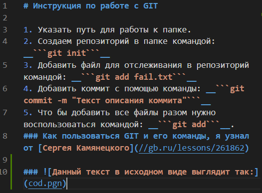

# Инструкция по работе с GIT

1. Указать путь для работы к папке.
2. Создаем репозиторий в папке командой: __```git init```__ 
3. Добавить файл для отслеживания в репозиторий командой: __```git add fail.txt```__
4. Добавить коммит с помощью команды: __```git commit -m "Текст описания коммита"```__
5. Что бы добавить все файлы разом нужно воспользоваться командой: __```git add.```__
### Как пользоваться GIT и его команды, я узнал от [Сергея Камянецкого](//gb.ru/lessons/261862).
 ## Команды GIT:
| Команда  | Описание |
| ------------- | ------------- |
| __```git init```__   | создание репозитория в папке  |
| __```git add .```__| добавить все файлы для отслеживания в репозитории | 
| __```git add fail.txt```__   | добавить файл для отслеживания в репозиторий  |
| __```git commit -m "Текст описания коммита```__ | Добавить коммит |
| __```git status```__| показать состояние репозитория (отслеживаемые, изменённые, новые файлы)| 
|__```git checkout b9533bb```__| переключиться на коммит с указанным хешем| 
|__```git checkout master```__ | переключиться на коммит master| 
| __```git log```__| показать коммиты| 
| __```git log master```__| показать коммиты в указанной ветке| 
|__```git log --graph```__ | показать коммиты с ASCII-представлением ветвления| 
| __```git show```__|показать изменения из коммита | 
| __```git branch ```__|показать список веток | 
| __```git branch new_branch```__|создать новую ветку с указанным именем на текущем коммите | 
| __```git branch -d hotfix```__| удалить ветку hotfix| 
| __```git show 60d6582```__| показать изменения из коммита с указанным хешем| 
| __```git merge hotfix```__|влить в ветку, в которой находимся, данные из ветки hotfix | 
| __```git remote -v```__| показать список удалённых репозиториев, связанных с локальным| 
| __```git push origin master```__|отправить в удалённый репозиторий (с сокр. именем origin) данные своей ветки master | 
| __```git pull origin```__| влить изменения с удалённого репозитория (все ветки)| 
| __```git pull origin master```__|влить изменения с удалённого репозитория (только указанная ветка) | 

---
### Данный текст в исходном виде выглядит так:

---
# Синтаксис Markdown:
## 1. Заголовки
# H1
## H2
### H3
#### H4
##### H5
###### H6  
### Альтернативные теги для H1 и H2 (знаки равно или минусы под заголовком + пустая строчка над загаловком):
---
## 2. Списки
###     Markdown поддерживает два вида списков: маркерованный и нумерованный. Для организации маркерованного списка используются знаки *, + и -. От них зависит вид маркеров. Чтоб сделать многоуровневый список, нужно будет сделать отступы (4 или 8 пробелов)

1. Первый пункт списка
2. Второй пункт
⋅⋅⋅* Немаркерованный вложенный подпункт. 
1. Номер не имеет значения, нужно чтобы это была просто любая цифра
⋅⋅⋅1. Маркерованный вложенный подпункт.
4. Тут другой пункт.
---
## 3. Цитаты
Для обозначения цитат достаточно поставить знак > в начале строки
>Это пример цитаты,
>в которой перед каждой строкой
>ставится угловая скобка.
---
## 4. Ссылки
### Подразумевается, что помимо URL-адреса существует еще текст ссылки. Он заключается в квадратные скобки. Для создания внутритекстовой гиперссылки необходимо использовать круглые скобки сразу после закрывающей квадратной. Внутри них необходимо поместить URL-адрес. В них же возможно расположить название, заключенное в кавычки, которое будет отображаться при наведении, но этот пункт не является обязательным.

```[пример](http://example.com/ "Необязательная подсказка")```   
или    
```[Example]: http://example.com/```
